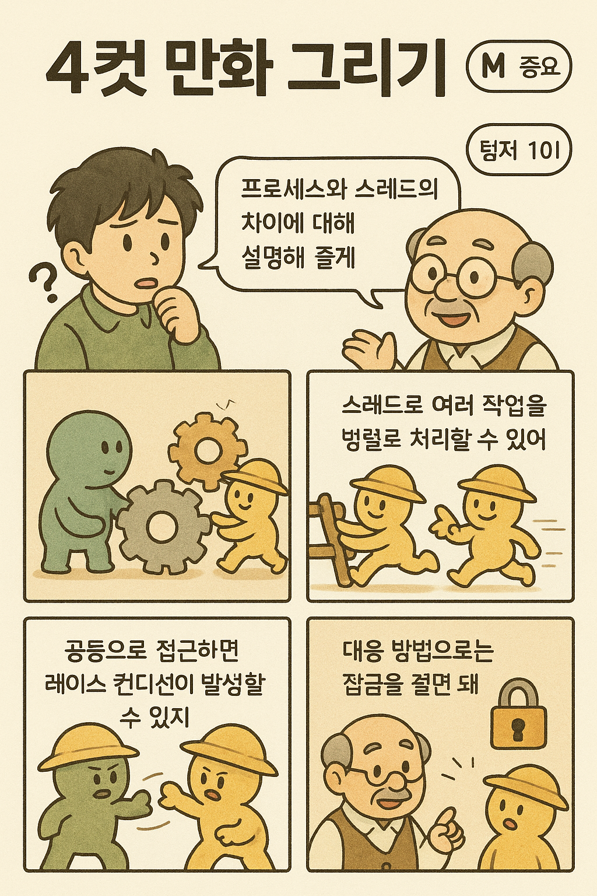
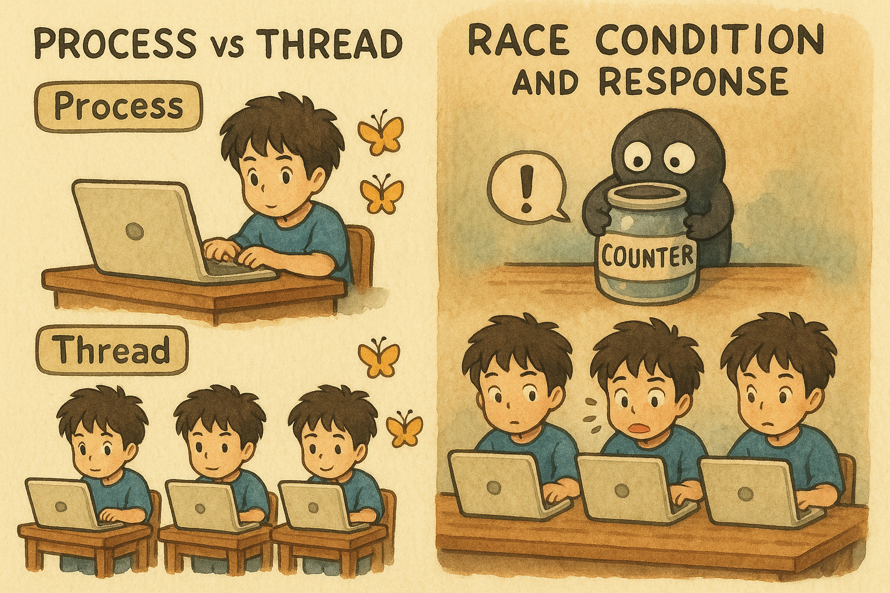
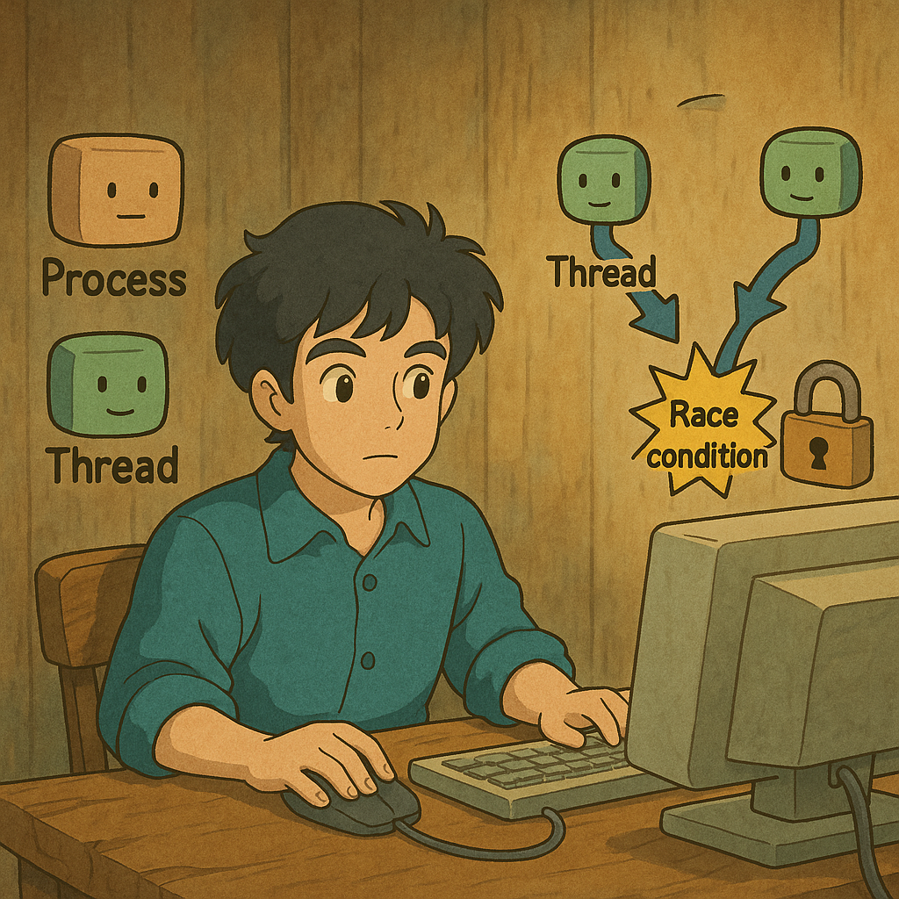
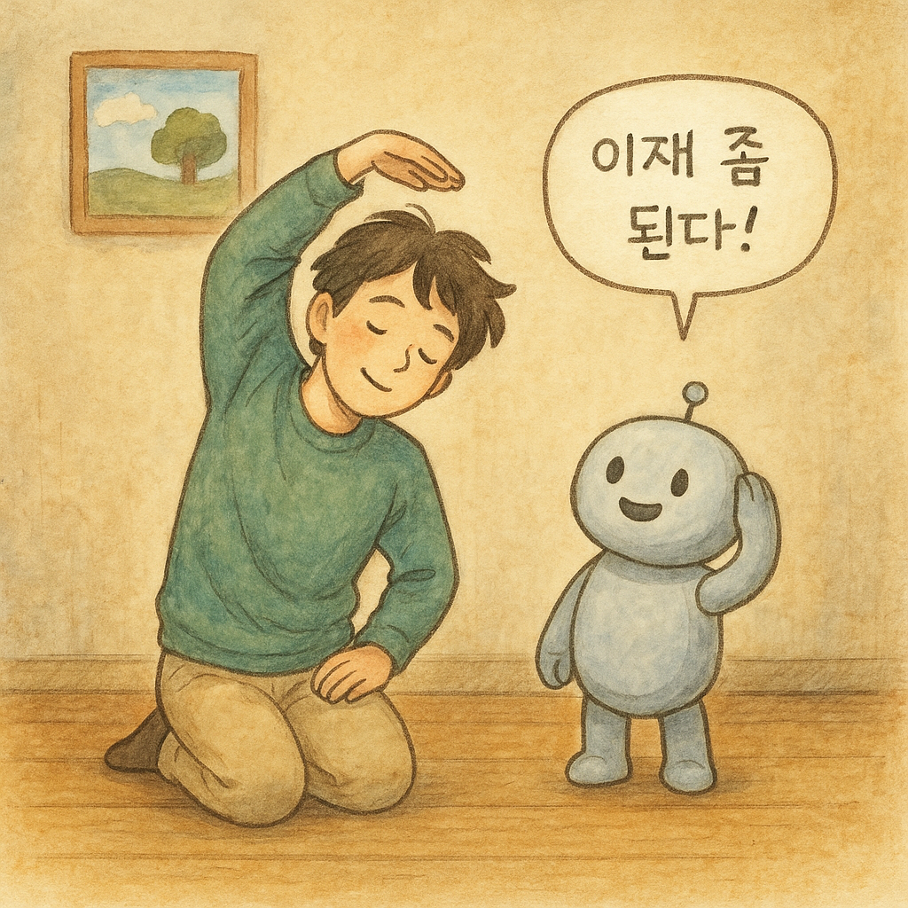
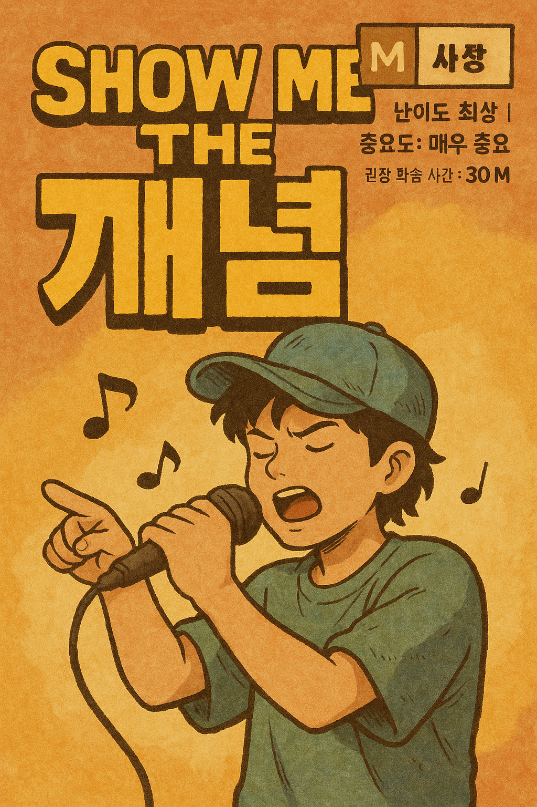

# Week2

# 주제 : 부스트캠프 커뮤니티 또는 개발자로서 학습과 성장을 위해 AI 활용하기

| 시간| 활동  | 활동 설명  |
| ------------- | --------------- | ------- |
| 13:00~14:00   | 수행 경험 공유하기  | 릴레이 프로젝트의 목적과 방법을 구두로 안내합니다. 라운지로 모이세요!  |
| 14:00~15:00   | 토론하기   | 어떤 프로젝트를 하면 좋을지 토론하며 좁혀 나갑니다.|
| 15:00~16:00   | 조사하기   | 토론 내용을 바탕으로 실제로 시도할 수 있는 방안, 참고 자료 등을 조사합니다. |
| 16:00~17:00   | 퀘스트 제작하기 | 한 주 동안 수행할 4개의 퀘스트를 만들어 릴레이 노트에 정리합니다. |
| 🔁  | 릴레이| 이어받을 퀘스트 노트를 확인하세요.  |
| 17:00~18:00   | 퀘스트 이어받기 | 다른 팀이 만든 퀘스트를 이어받고, 해석하고, 수행 계획을 세웁니다. |
| 다음 릴프까지 | 퀘스트 수행하기 | 한 주간 퀘스트를 수행하고, 과정을 기록합니다. |

- AI로 이런 것도 해도 되나? -> 됨
  - 출결 대신 해주는 AI -> 그건 안됨
- 시간 남는데 수다 떨어도 되나? -> 됨
- 대충하고 빨리 끝내는 건 안됨

# 토론

## AI를 이겨라
- 첫 퀘스트 설명을 보면 어떤 내용인지 확인하기 힘들지만 week1 수행 내용을 보고 흥미를 느껴 이 퀘스트가 유지되기를 원함
- 예시를 더 추가해서 설명 보완
- 인증 방법 추가
- 예시 게임 추가
- 다른 LLM 모델 이용해보기 추가
  - Claude 문서화가 너무 기계적
  - perplexity 검색에 특화

## 기분전환
- 그대로 가져가자
- 슬랙 공유는 필수 아닌 권장
- 명확한 제목으로 바꾸기 (너무 포괄적)
- 꼭 음악이 아니어도 되게
  - 음악 아닌 주제 추가
    - 예시: 묘사만으로 내가 원하는 스타일로 그리기

## AI 추천 운동 루틴 실천하기
- 개발자를 위한 스트레칭으로 변경
- 외출 강요 자제

## 무플방지위원회
- 새로운 미션으로 대체
  - 미션을 구현하는 동안 슬랙에 올라오는 모든 글을 파악하기 힘듦
  - 무플방지위원회리고 작성하면 무시하는 느낌을 받을 수 있지 않을까?

## 새로운 미션
- 개념을 이해하기 쉽게 AI를 활용해 4컷 만화 그리기
- 학습목표를 기반으로 SUNO AI를 활용해 음악 만들기

---

## 📜 Week2 퀘스트

## AI를 이겨라 Ⓜ️ 난이도 `중` 중요도 `매우중요` 권장 학습 시간 `30M` 미션 해결 예상 시간 `30M`


### 학습 목표

- 혼자 공부하다 보면 집중이 흐트러지고 `AI`와 단 둘이 대화하는 시간이 점점 길어지는데 이를 해결할 방법을 학습한다.
- 이에 활용할 `AI`는 무엇이 있는지 스스로 결정한다.

### 프로그래밍 요구사항

- `AI`와 조금 더 친근하게 가벼운 놀이를 통해 스트레스를 해소하고 학습/구현의 스트레스를 가볍게 해소하는 통로가 된다.
- `AI`와의 소통 경험을 쌓는다.

### 달성 기준
- [ ] 게임 종목을 정하고, AI와 플레이한 화면을 캡처해 `Week2.md`에 첨부한다. (필수)
- [ ] 다양한 AI 모델으로 시도해본다. (선택)
- [ ] AI에게 승리할 때까지 반복해서 도전해본다 (필수)
- [ ] AI와의 플레이 후 느낀 점을 `Week2.md`에 작성한다. (필수)

### 예상결과 및 동작예시


#### week1 - K023님 수행 화면 (홀짝게임)


#### week1 - K023님 수행 화면 (스무고개)


---

## 4컷 만화 그리기 Ⓜ️ 난이도 `하` 중요도 `중요` 권장 학습 시간 `10M` 미션해결 예상 시간 `10M`



### 배경

- 많은 챌린저들이 개념을 이해하는데 많은 시간을 소모한다. 그들에게 이해하기 쉽게 4컷 만화를 만들어 설명을 보충한다.

### 목적

- 이해하기 어려운 개념들을 이해하기 쉽게 만화로 표현해서 기억에 오랫동안 남을 수 있다
- 추상적인 개념을 그림을 통해 직관적으로 이해한다.

### 달성기준

- [ ] AI에게 오늘 학습한 주제에 대해 4컷만화 형식으로 그려달라고 요청한다. (필수)
- [ ] 작성한 프롬포트와 생성된 4컷 만화를 `Week2.md`에 첨부한다. (필수)
- [ ] AI로 4컷 만화를 만든 후 느낀 점을 `Week2.md`에 작성한다. (필수)

### 예시



---

## AI 추천 스트레칭 실천하기 Ⓜ️ 난이도 `상` | 중요도 `매우 중요` | 권장 학습 시간 `20M`



### 배경

- 많은 캠퍼들이 잠을 못자고 체력적인 한계를 느끼는 것에 동감할 것이다. 머리로는 알지만 실천하기 힘든 그 미션을 수행해보자.

### 목적

- 건강한 신체에서 나오는 건강한 아이디어의 힘을 추구하자.
- 좋은 몸은 아니더라도 무기력한 몸은 되지 말자!
- 일정한 생활패턴을 생성하고 스트레칭을 미션 중에도 생활화 하자!

### 달성 기준

- [ ] AI의 추천 스트레칭 방법을 `Week2.md`에 기록한다. (필수)
- [ ] AI에게 추천 스트레칭을 받은 화면을 캡처해 첨부한다. (필수)
- [ ] 여러 AI 모델에게 물어보고 마음에 드는 스트레칭을 해본다. (선택)
- [ ] 직접 스트레칭을 실천하고, 실천 후 `week2.md`에 소감을 작성한다. (필수)

### 예시

- Perplexity 프롬프트

```
개발자에게 추천하고 싶은 스트레칭 목록을 알려줘. 영상도 좋고 이미지도 좋아
```

- 답변 

장시간 앉아 코딩하는 개발자에게는 **어깨**, **목**, **허리**, **손목** 등 특정 부위의 경직과 통증이 흔합니다. 아래 추천 스트레칭 목록은 사무실이나 집, 체육관 어디서든 쉽게 따라할 수 있도록 구성되었으며, 동영상, 이미지 등 시각 자료도 함께 안내합니다. 운동 동기부여를 좋아하신다면, 체육관에서 동작 스트레칭을 같이 하며 동료에게 영감을 줄 수도 있습니다.

### 필수 추천 스트레칭 목록

| 부위 | 주의 징후    | 권장 동작(간단 설명)   | 시각 자료|
|-----------|-----|-----------------------------|-------|
| **목**    | 거북목, 뻐근함, 굳음    | 옆으로 45도 기울이기, 수건이나 테니스공 이용 스트레칭 | [아주대병원TV 거북목 스트레칭][1], [코딩애플 반전술식 영상][2] |
| **어깨**  | 무거움, 뻐근함| 삼두근 스트레칭, 어깨 롤링, 깍지낀 팔 앞으로 내밀기    | [전신스트레칭 30개 루틴][3]   |
| **허리**  | 통증, 뻐근함, 굽어짐    | 가슴 열고 뒤로 젖히기, 코브라 포즈, 누워서 무릎 끌어당기기 | [강남세브란스 허리 스트레칭][4], [TOP 5 스트레칭][5] |
| **손목**  | 저림, 통증, 손목터널증후군 의심    | 손목 펴기, 고무공 쥐기, 손가락 접었다 펴기  | [이랜서 개발자 손목 스트레칭][6]   |
| **하체**  | 굳음, 붓기   | 햄스트링 스트레칭, 런지, 발목 돌리기   | [전신스트레칭 30개 루틴][3], [TOP 5 스트레칭][5] |

[1]: https://www.youtube.com/watch?v=-nOgOs4r6Ys  
[2]: https://www.youtube.com/watch?v=VwjfT82BqQI  
[3]: https://www.youtube.com/watch?v=x_3H0ID-5i0  
[4]: https://www.youtube.com/watch?v=lx6a5rFZc68  
[5]: https://www.youtube.com/watch?v=zyz8ip_jRso  
[6]: https://www.elancer.co.kr/blog/detail/196  

---

## SHOW ME THE 개념 Ⓜ️ 난이도 `최상` | 중요도 : `매우 중요` | 권장 학습 시간 : `30M`



### 배경

- 학습 목표를 보고 다들 어떻게 학습해야 할지 막막함을 느껴본 적이 있을 것이다. 그를 해소하기 위해 보다 친근한 노래로 접근해보자.

### 목적

- 학습 목표를 노래로 만들어 중요 개념을 잊지 않도록 기억 속에 각인시켜보자

### 예상결과 및 동작예시

[SUNO](https://suno.com/) 프롬프팅 예시

```
프로세스와 스레드의 차이점을 이해하고, 스레드로 병렬 처리를 할 수 있도록 구현한다.  멀티 스레드 환경에서 공동 리소스에 접근하는 경우 레이스 컨디션이 발행하는 원리와 대응 방법을 구현한다. 이 학습목표를 기반으로 힙합 만들어줘
```

[](https://suno.com/s/KvA81hLtRvLSzGsU)  [](https://suno.com/s/19QNM6L4DSXilydR)

각 이미지를 누르면 생성된 노래로 연결됩니다.

### 달성 기준

- [ ] 학습 목표를 바탕으로 AI에게 노래를 생성하도록 요청한다. (필수)
- [ ] 노래를 듣고 학습 목표가 어떻게 노래에 반영되었는지 확인한다. (필수)
- [ ] 노래 생성시 사용한 프롬프트와 생성된 노래를 `Week2.md`에 기록한다. (필수)
- [ ] 노래 감상 후 소감을 `Week2.md`에 기록한다. (필수)

---
<br>


# Week2 - 퀘스트 이어받기

## 이어받은 팀 : 13그룹

## 수행할 퀘스트 목록

#### [K019 윤미오]
- **선정한 퀘스트**
   - AI를 이겨라 Ⓜ️
- **선정 이유**
   - 미션 해결에 몰입하다보면 식사나 화장실이나 그 외의 것들을 놓치게 되는 경우가 있다.
   - 그런 순간에 하나의 미션인 퀘스트를 실행하므로써, 머릿속을 환기시키고 소소한 즐거움을 느끼고 싶었다.
   - 가벼운 게임 이후 리프레쉬된 상황에서 집중력을 다시 끌어올리고자 이 퀘스트를 선택했다.
- **진행 내용**
   - 예정
<br>

#### [J020 권민서]
- **선정한 퀘스트**
   - 4컷 만화 그리기 Ⓜ️
- **선정 이유**
   - 이해하기 어려운 내용을 만화로 만들어 친근하고 접근할 수 있고, 재밌게 학습하여 지속가능한 성장을 기대해볼 수 있다.
- **진행 내용**
   - 느낌점: 학습 내용을 담기에는 네컷은 부족하다는 느낌이 들었지만, 학습한 내용을 만화로 요약해서 볼 수 있는게 재밌었다. 이해하기 어려운 내용을 만화로 이해하기는 쉽지 않을 것 같다.


  

<br>

#### [J212 이주호]
- **선정한 퀘스트**
   - SHOW ME THE 개념 Ⓜ️
- **선정 이유**
   - 요즘 코딩할때 창팝을 듣는데 코딩도 이걸로 바꿔서 부르면 재밌을 거같다
   - 영어시간에 가르쳐준 노래가 인상이 깊어 기억이 잘됐던 기억이 나서 도움이 될것 같았다
   - 가사에 라임을 넣으면 금방 기억이 날것같다
- **진행 내용**
   - 예정
<br>

#### [J288 허우솔]
- **선정한 퀘스트**
   - 4컷 만화 그리기 Ⓜ️
- **선정 이유**
   - 글은 압축된 정보를 빠르게 받아들일 수 있는 좋은 수단이지만 때론 너무 딱딱해 이해가 어렵다
   - 만화로 개념을 표현한다면 좀 더 쉽고 빠르게 개념을 이해하고 원활하게 미션을 수행할 수 있을 것 같아 선정했다.
- **진행 내용**
   - 예정
